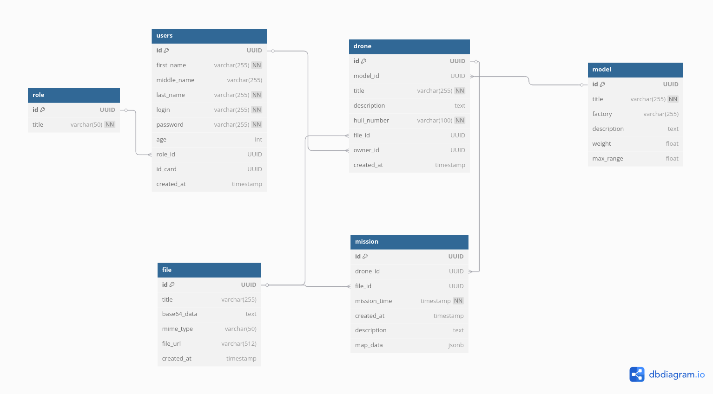
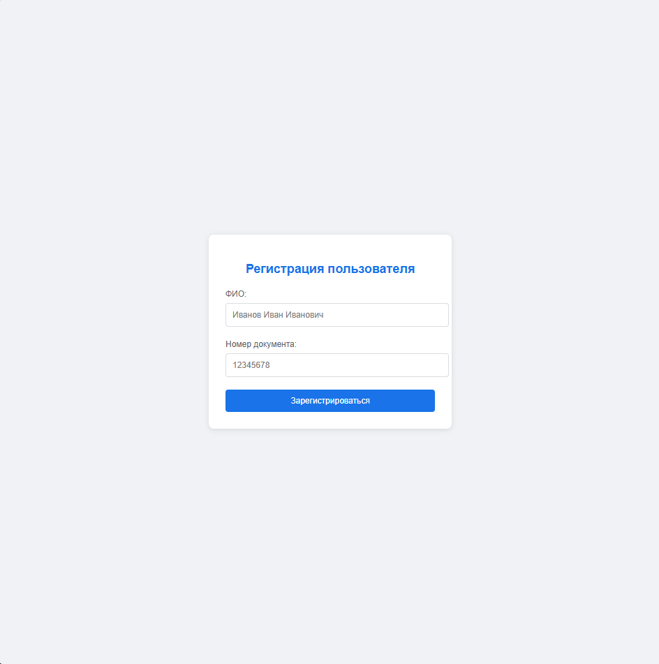
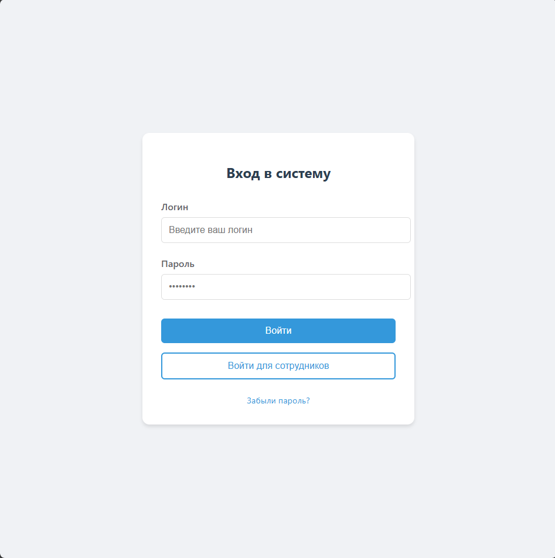
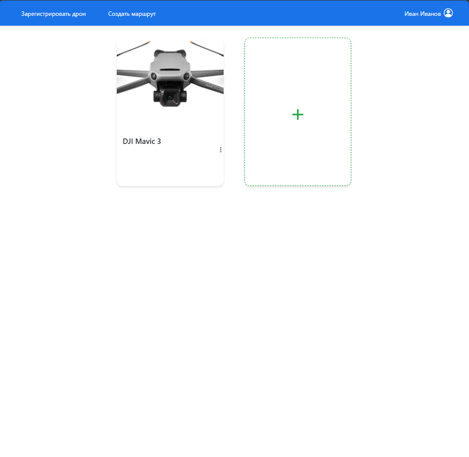
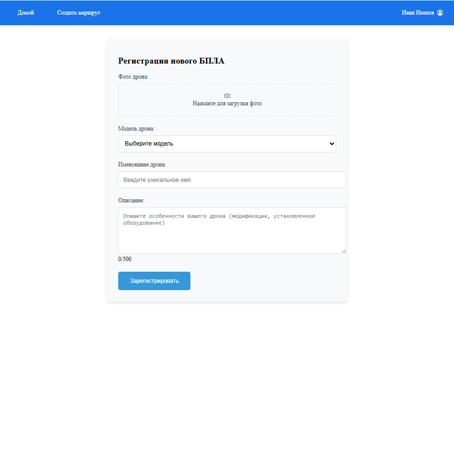
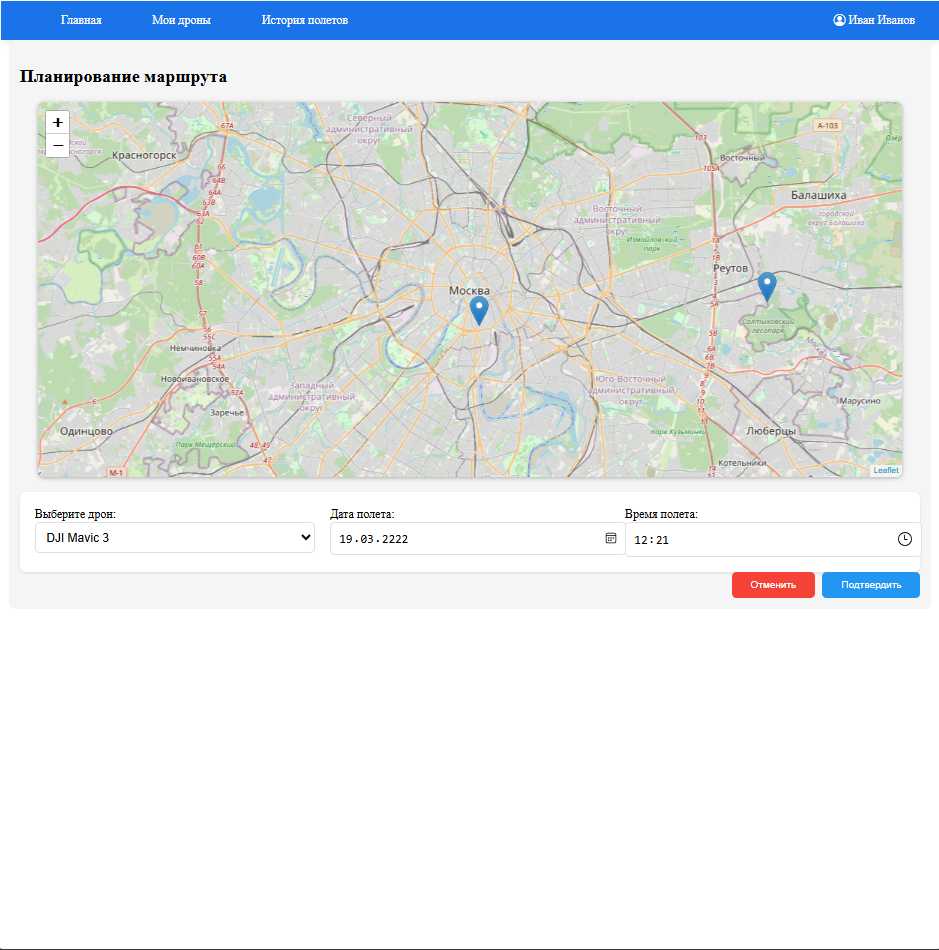
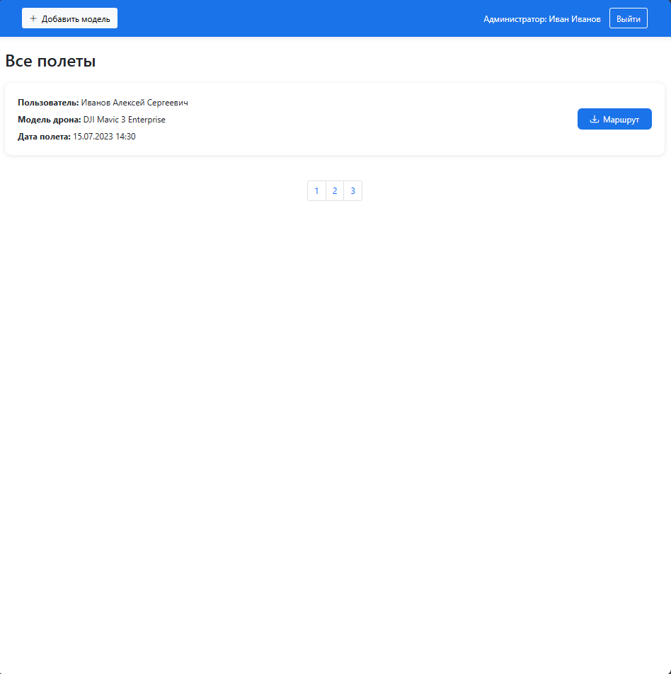
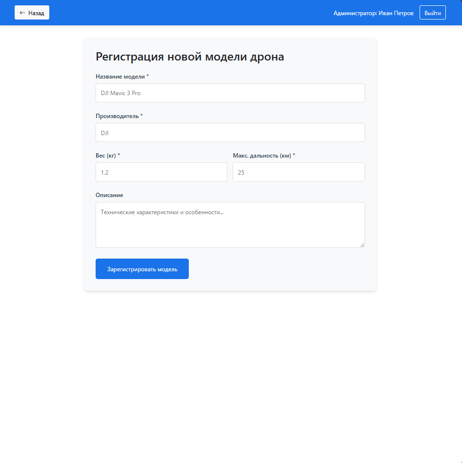

## Анализ целевой аудитории

## 1. Сегментация аудитории

Целевую аудиторию можно разделить на две ключевые группы:

| Группа | Описание | Примеры использования |
|--------|----------|----------------------|
| **Любители** | Физические лица, использующие дроны для хобби: фото/видеосъемка, развлечения | Съемка природы, семейных мероприятий, путешествий |
| **Коммерческие пользователи** | Малый бизнес и фрилансеры, применяющие БПЛА для профессиональных задач | Доставка мелких грузов, агромониторинг, инспекция объектов |

## 2. Демографические характеристики

### Возраст
18–55 лет (основная активность — 25–40 лет)

### География
- **Городские жители (70%)** — высокая плотность запрещенных зон (аэропорты, инфраструктура)
- **Сельские жители (30%)** — потребность в мониторинге территорий, сельхозработах

## 3. Потребности и проблемы целевых групп

| Группа | Потребности | Проблемы |
|--------|-------------|----------|
| **Любители** | • Простое планирование маршрутов • Легализация полетов без бюрократии  | • Страх нарушить закон • Сложности с ручным вводом координат |
| **Коммерческие пользователи** | • Быстрое согласование полетов с регуляторами • Интеграция с госреестрами • Автоматизация отчетности | • Потери времени из-за ручной регистрации • Риск штрафов за нарушения |

## 4. Ключевые ожидания от приложения

### Упрощение регистрации БПЛА
- Автозаполнение данных дрона по серийному номеру (сканирование QR-кода)
- Интеграция с государственными реестрами (например, Росавиация)

### Интерактивное планирование
- Карта с подсветкой запрещенных зон в реальном времени
- Возможность сохранять шаблоны маршрутов

### Легализация полетов
- Автоматическая генерация разрешительных документов
- Уведомления об изменениях в законодательстве

## 5. Выводы и рекомендации

### Приоритетные функции для разработки
- **Интуитивный интерфейс** для всех категорий пользователей
- **Автоматизация процессов** для снижения барьеров входа
- **Интеграция с регуляторными органами** для упрощения легализации

### Критические требования
- Простота использования для новичков
- Скорость обработки для коммерческих пользователей
- Визуальная привлекательность для любителей

### Use Case 

Гост - Регистрируется

Пилот дрона - просматривает список доступных дронов, добавляет новые дроны, создает маршруты. 

Администратор - создает модели дронов доступные для регистрации, просматривает полетные маршруты пользователей.

### Создание ER диаграммы 

### Структура таблиц 

### Таблица **Role**
| Атрибут | Тип данных     | Описание                   |
|---------|----------------|---------------------------|
| `id`    | `UUID`         | Первичный ключ            |
| `title` | `VARCHAR(50)` | Название роли (NOT NULL)  |

### Таблица **User**
| Атрибут          | Тип данных     | Описание                            |
|------------------|----------------|-------------------------------------|
| `id`             | `UUID`         | Первичный ключ                      |
| `first_name`     | `VARCHAR(255)` | Имя (NOT NULL)                      |
| `middle_name`    | `VARCHAR(255)` | Отчество                            |
| `last_name`      | `VARCHAR(255)` | Фамилия (NOT NULL)                  |
| `login`          | `VARCHAR(255)` | Уникальный логин (NOT NULL, UNIQUE) |
| `password`       | `VARCHAR(255)` | Пароль (NOT NULL)                   |
| `age`            | `INT`          | Возраст (CHECK: `age >= 0`)         |
| `role_id`        | `UUID`         | Внешний ключ к `role.id`            |
| `id_card_series` | `INT`          | Серия паспорта                      |
| `id_card_number` | `INT`          |Номер паспорта
| `created_at`     | `TIMESTAMP`    | Дата создания (DEFAULT: `NOW()`)    |

### Таблица **Model**
| Атрибут        | Тип данных     | Описание                              |
|----------------|----------------|--------------------------------------|
| `id`           | `UUID`         | Первичный ключ                       |
| `title`        | `VARCHAR(255)` | Название модели (NOT NULL)           |
| `factory`      | `VARCHAR(255)` | Производитель                        |
| `description`  | `TEXT`         | Описание модели                      |
| `weight`       | `FLOAT`        | Вес (CHECK: `weight > 0`)            |
| `max_range`    | `FLOAT`        | Максимальная дальность (CHECK: `max_range > 0`) |

### Таблица **File**
| Атрибут         | Тип данных      | Описание                              |
|------------------|-----------------|--------------------------------------|
| `id`            | `UUID`          | Первичный ключ                       |
| `title`         | `VARCHAR(255)`  | Название файла                       |
| `base64_data`   | `TEXT`          | Данные в Base64                      |
| `mime_type`     | `VARCHAR(50)`   | MIME-тип файла                       |
| `created_at`    | `TIMESTAMP`     | Дата создания (DEFAULT: `NOW()`)     |

### Таблица **Drone**
| Атрибут         | Тип данных      | Описание                              |
|------------------|-----------------|--------------------------------------|
| `id`            | `UUID`          | Первичный ключ                       |
| `model_id`      | `UUID`          | Внешний ключ к `model.id`            |
| `title`         | `VARCHAR(255)`  | Название дрона (NOT NULL)            |
| `description`   | `TEXT`          | Описание дрона                       |
| `hull_number`   | `VARCHAR(100)`  | Серийный номер (NOT NULL, UNIQUE)    |
|  `photo` | `Bytes`| Фото дрона|
| `file_id`       | `UUID`          | Внешний ключ к `file.id`             |
| `owner_id`      | `UUID`          | Внешний ключ к `user.id`             |
| `created_at`    | `TIMESTAMP`     | Дата создания (DEFAULT: `NOW()`)     |
| `delete`    | `Bool`     | Мягкое удаление (DEFAULT: `False`)     |

### Таблица **Mission**
| Атрибут          | Тип данных      | Описание                              |
|-------------------|-----------------|--------------------------------------|
| `id`             | `UUID`          | Первичный ключ                       |
| `drone_id`       | `UUID`          | Внешний ключ к `drone.id`            |
| `file_id`        | `UUID`          | Внешний ключ к `file.id`             |
| `mission_time`   | `TIMESTAMP`     | Время миссии (NOT NULL)              |
| `created_at`     | `TIMESTAMP`     | Дата создания (DEFAULT: `NOW()`)     |
| `description`    | `TEXT`          | Описание миссии                      |
| `map_data`       | `JSONB`         | Данные карты в формате JSON          |

## Разработка макетов страниц

### Пользователь

### Администратор

