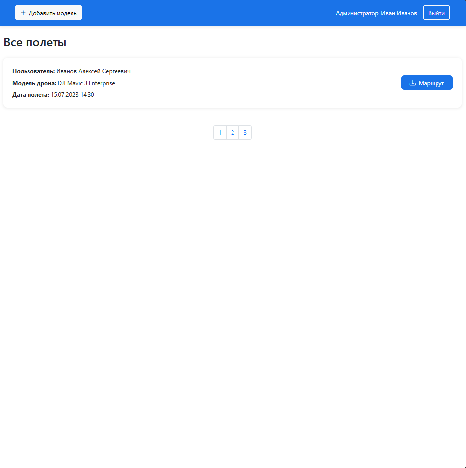

# Анализ предметной области

## Обзор существующих программных продуктов по теме работы

Цель исследования 

Выявление функциональных и архитектурных особенностей современных приложений 
для регистрации и планирования полетов беспилотных летательных аппаратов. 

### Методология

#### Выбор аналогов 

Рассмотрим наиболее популярные решения 

- Портал "Госуслуги"
- Приложение AirMap

#### Критерии анализа

- Доступность приложения
- Наличие инетерактивной карты для планирования маршрута
- Выдача документов о разрешении полета
- Регистрация БПЛА в системе

#### Источники информации

### Анализ аналогов 

#### Доступность приложения

Госуслуги:
Приложение доступно бесплатно, интегрировано в государственный портал. Требуется обязательная регистрация через учетную запись на «Госуслугах». Интерфейс на русском языке, но отсутствует мобильная версия для оперативного планирования полетов.  
Недостаток: Нет офлайн-доступа, требуется стабильное интернет-соединение.
  
  AirMap:
Доступен как веб-сервис и мобильное приложение (iOS/Android). Базовая версия бесплатна, но ключевые функции: автоматическая проверка маршрута, интеграция с регуляторами доступны по подписке от $10/мес.
Недостаток: Платный функционал ограничивает использование для гражданских лиц с низким бюджетом. Имеет ограничения по региону использования.

#### Наличие интерактивной карты для планирования маршрута

Госуслуги:
Интерактивная карта отсутствует. Пользователь указывает зону полета текстовым описанием или выбирает из списка запрещенных зон.
Недостаток: Риск ошибок из-за ручного ввода координат. Например, полет над частной территорией может быть не замечен при текстовом описании.

  AirMap:
Есть детализированная карта с слоями: зоны ограничений (аэропорты, военные объекты), погодные условия, высотные ограничения. Маршрут строится визуально, с автоматической проверкой на конфликты.
Недостаток: Карта не учитывает актуальные российские ограничения, что снижает её полезность в РФ.

#### Выдача документов о разрешении полета

Госуслуги:
После регистрации БПЛА и подачи уведомления система генерирует PDF-документ с номером разрешения. Документ необходимо распечатать или сохранить в электронном виде для предъявления по требованию.

AirMap:
Для США/ЕС платформа автоматически отправляет уведомление в FAA или местный регулятор. Пользователь получает цифровое разрешение с QR-кодом, который привязан к данным полета.

#### Регистрация БПЛА в системе

Госуслуги:
Регистрация БПЛА обязательна для дронов тяжелее 250 г. Пользователь вносит данные вручную: серийный номер, модель, вес, фото аппарата. Данные сохраняются в госреестре.

AirMap:
Регистрация БПЛА добровольна (кроме случаев, требуемых локальным законодательством). Можно добавить несколько дронов в профиль, указав базовые параметры (модель, класс).

#### Сравнительная таблица 

| Критерий                | Госуслуги                   | AirMap                                  |
|-------------------------|-----------------------------|-----------------------------------------|
| Доступность             | Бесплатно | Платные функции, ограничения по региону |
| Интерактивная карта     | Нет                         | Да                                      |
| Документы о разрешении  | PDF-документ                | Цифровое разрешение с QR-кодом          |
| Регистрация БПЛА        | Обязательная, ручной ввод   | Добровольная, минимальные данные        |

### Выводы 

## Анализ программных инструментов разработки веб-приложений

## Сравнение Backend фреймворков

| Критерий | Flask | FastAPI | Django |
|----------|-------|---------|--------|
| **Скорость разработки** | Минималистичный, гибкий, но требует ручной настройки многих компонентов. Подходит для небольших проектов. | Автоматическая генерация документации (Swagger/OpenAPI), валидация данных через Pydantic, асинхронность. Минимальный boilerplate-код. | Монолитный, включает множество встроенных инструментов (ORM, админка), но требует времени на изучение и настройку. |
| **Производительность** | Синхронный, подходит для простых задач. Низкая производительность при высоких нагрузках. | Асинхронная обработка запросов, высокая скорость благодаря Starlette и ASGI. | Синхронный, оптимизирован для типовых задач, но уступает FastAPI в скорости обработки API. |
| **Безопасность** | Базовые функции безопасности, требуется ручная реализация многих механизмов (например, валидация данных). | Встроенная валидация и сериализация данных через Pydantic, защита от инъекций, поддержка OAuth2. | Встроенные защиты (CSRF, XSS), но для API требуется Django REST Framework, что усложняет настройку. |
| **Современность** | Устаревшая архитектура для API (синхронная, нет встроенной поддержки асинхронности). | Современный подход (ASGI, поддержка WebSockets, интеграция с GraphQL), активно развивается. | Ориентирован на классические MVC-приложения, менее гибок для микросервисов и современных API. |
| **Поддержка MVP** | Подходит для MVP, но требует дополнительных расширений (Flask-SQLAlchemy, Flask-JWT). | Идеален для MVP: быстрая реализация эндпоинтов, автоматическая документация, минимум зависимостей. | Избыточность для MVP: встроенные компоненты (админка, ORM) замедляют старт. |

**Итог:** FastAPI — оптимальный выбор для MVP благодаря скорости разработки, асинхронности, встроенной безопасности и автоматической документации. Это сокращает время на интеграцию и тестирование.

## Сравнение MySQL, SQLite и PostgreSQL (в пользу PostgreSQL)

| Критерий | SQLite | MySQL | PostgreSQL |
|----------|--------|-------|------------|
| **Масштабируемость** | Для однопользовательских приложений, не поддерживает параллельные запросы. | Поддерживает высокие нагрузки, но ограничен в сложных транзакциях. | Оптимален для высоких нагрузок, поддержка параллелизма через MVCC. |
| **Типы данных** | Ограниченный набор типов (нет массивов, JSON). | Поддержка JSON, но с ограниченными функциями. | Расширенные типы (JSONB, геоданные, массивы), полноценная работа с JSON. |
| **Безопасность** | Минимальные встроенные механизмы (например, нет ролевой модели). | Базовые роли и привилегии. | Гибкая система прав, SSL-шифрование, защита от SQL-инъекций. |
| **Расширяемость** | Невозможно добавлять пользовательские функции и расширения. | Ограниченные возможности кастомизации. | Поддержка расширений (PostGIS, Full-Text Search), возможность писать функции на Python, JS. |

**Итог:** PostgreSQL обеспечивает масштабируемость, безопасность и гибкость, а также поддерживает работу с JSON, что критично в нашем проекте.

## Сравнение HTML + JS + Bootstrap vs React/Angular (в пользу HTML + JS)

| Критерий | HTML + JS + Bootstrap | React/Angular |
|----------|----------------------|---------------|
| **Скорость разработки** | Мгновенный старт: нет необходимости настраивать сборщики (Webpack, Babel). Готовые компоненты Bootstrap. | Требуется время на настройку окружения, изучение синтаксиса (JSX, TypeScript). |
| **Производительность** | Минимум накладных расходов: нет виртуального DOM или runtime-библиотек. | Виртуальный DOM (React) и проверки изменений могут замедлять рендеринг. |
| **Гибкость** | Полный контроль над кодом, можно интегрировать любые библиотеки. | Жесткая архитектура (особенно Angular), зависимость от lifecycle-методов. |
| **Поддержка MVP** | Идеально для прототипов: быстрое создание адаптивных интерфейсов через Bootstrap. | Избыточно для простых проектов: сложность стейт-менеджмента (Redux, NgRx). |

**Итог:** HTML + JS + Bootstrap позволяет быстро создать MVP с минимальными затратами, избегая перегруженности инструментами. 

## Общий вывод

- **Backend:** FastAPI + PostgreSQL обеспечивают скорость разработки, безопасность и масштабируемость.
- **Frontend:** HTML + JS + Bootstrap позволяют быстро создать MVP без избыточной сложности.

## Формулировка целей и задач работы 

# Проект: Система управления дронами

## Описание проекта

Разработать веб-приложение, предоставляющее пользователям инструменты для:

- **Регистрации и управления дронами** с возможностью загрузки технических характеристик и фотографий
- **Планирования маршрутов полетов** с выбором точек и генерацией документации
- **Получения сертификатов** на зарегистрированные дроны
- **Администрирования моделей дронов** через ролевую модель (пользователь/администратор)

## Задачи проекта

### 1. Реализация системы аутентификации
- Регистрация новых пользователей с валидацией данных
- Авторизация пользователей через логин/пароль
- Шифрование паролей и обеспечение безопасности сессий
- Разграничение прав доступа (пользователь/администратор)

### 2. CRUD-интерфейс для управления дронами
- **Регистрация дронов:**
  - Заполнение технических характеристик (модель, серийный номер, вес, габариты)
  - Загрузка и обработка фотографий дронов
  - Привязка дрона к пользователю
- **Управление дронами:**
  - Просмотр списка зарегистрированных дронов
  - Редактирование информации о дронах
  - Удаление дронов из системы (мягкое удаление)

### 3. Система планирования маршрутов
- **Интерактивная карта:**
  - Выбор точек маршрута на карте
  - Визуализация маршрута для пользователя

- **Генерация документации:**
  - Создание карты маршрута с координатами
  - Планирование дат и времени полетов
  - Экспорт документов в PDF формате

### 4. Система сертификации
- Автоматическая генерация сертификатов после регистрации дрона

### 5. Админ-панель
- **Управление моделями дронов:**
  - Добавление новых моделей в справочник
  - Редактирование технических характеристик моделей
  - Удаление устаревших моделей

## Деплой и тестирование проекта

 - Деплой проекта на сервер
 - Проведение функционального тестирования

# Ожидаемые результаты

## 1. Функциональное приложение

- **Пользователи могут:**
  - Регистрировать свои дроны с загрузкой технических характеристик и фотографий
  - Планировать маршруты полетов с интерактивной картой
  - Получать автоматически сгенерированные сертификаты на зарегистрированные дроны
  - Экспортировать данные о дронах и маршрутах

- **Администраторы имеют возможность:**
  - Управлять справочником моделей дронов (добавление, редактирование, удаление)
  - Контролировать процесс регистрации дронов пользователями

## 2. Документация

- **Техническое описание:**
  - Архитектура системы с диаграммами компонентов
  - Схема базы данных и модель данных

- **Пользовательская документация:**
  - Руководство по регистрации дронов
  - Инструкция по планированию маршрутов

- **Административная документация:**
  - Руководство по управлению моделями дронов

## 3. Исходный код

- **Git-репозиторий:**
  - Структурированная организация кода по модулям
  - README с инструкциями по развертыванию

- **CI/CD-пайплайн:**
  - Автоматическое тестирование при каждом коммите
  - Интеграция с системами контроля качества кода

## Связь целей с анализом целевой аудитории

### Выявленные проблемы рынка:
- **Отсутствие интерактивных карт:** В российском сегменте текущее решение не позволяет использовать интерактивные карты, что усложняет процесс создания полетного маршрута.

### Решения в проекте:
- **Реализация интерактивной карты**
- **Высокая совместимость по функционалу с текущими российскими решениями**

## Анализ целевой аудитории

## 1. Сегментация аудитории

Целевую аудиторию можно разделить на две ключевые группы:

| Группа | Описание | Примеры использования |
|--------|----------|----------------------|
| **Любители** | Физические лица, использующие дроны для хобби: фото/видеосъемка, развлечения | Съемка природы, семейных мероприятий, путешествий |
| **Коммерческие пользователи** | Малый бизнес и фрилансеры, применяющие БПЛА для профессиональных задач | Доставка мелких грузов, агромониторинг, инспекция объектов |

## 2. Демографические характеристики

### Возраст
18–55 лет (основная активность — 25–40 лет)

### География
- **Городские жители (70%)** — высокая плотность запрещенных зон (аэропорты, инфраструктура)
- **Сельские жители (30%)** — потребность в мониторинге территорий, сельхозработах

## 3. Потребности и проблемы целевых групп

| Группа | Потребности | Проблемы |
|--------|-------------|----------|
| **Любители** | • Простое планирование маршрутов • Легализация полетов без бюрократии  | • Страх нарушить закон • Сложности с ручным вводом координат |
| **Коммерческие пользователи** | • Быстрое согласование полетов с регуляторами • Интеграция с госреестрами • Автоматизация отчетности | • Потери времени из-за ручной регистрации • Риск штрафов за нарушения |

## 4. Ключевые ожидания от приложения

### Упрощение регистрации БПЛА
- Автозаполнение данных дрона по серийному номеру (сканирование QR-кода)
- Интеграция с государственными реестрами (например, Росавиация)

### Интерактивное планирование
- Карта с подсветкой запрещенных зон в реальном времени
- Возможность сохранять шаблоны маршрутов

### Легализация полетов
- Автоматическая генерация разрешительных документов
- Уведомления об изменениях в законодательстве

## 5. Выводы и рекомендации

### Приоритетные функции для разработки
- **Интуитивный интерфейс** для всех категорий пользователей
- **Автоматизация процессов** для снижения барьеров входа
- **Интеграция с регуляторными органами** для упрощения легализации

### Критические требования
- Простота использования для новичков
- Скорость обработки для коммерческих пользователей
- Визуальная привлекательность для любителей

### Use Case 

Гост - Регистрируется

Пилот дрона - просматривает список доступных дронов, добавляет новые дроны, создает маршруты. 

Администратор - создает модели дронов доступные для регистрации, просматривает полетные маршруты пользователей.

### Создание ER диаграммы 

### Структура таблиц 

### Таблица **Role**
| Атрибут | Тип данных     | Описание                   |
|---------|----------------|---------------------------|
| `id`    | `UUID`         | Первичный ключ            |
| `title` | `VARCHAR(50)` | Название роли (NOT NULL)  |

### Таблица **User**
| Атрибут          | Тип данных     | Описание                            |
|------------------|----------------|-------------------------------------|
| `id`             | `UUID`         | Первичный ключ                      |
| `first_name`     | `VARCHAR(255)` | Имя (NOT NULL)                      |
| `middle_name`    | `VARCHAR(255)` | Отчество                            |
| `last_name`      | `VARCHAR(255)` | Фамилия (NOT NULL)                  |
| `login`          | `VARCHAR(255)` | Уникальный логин (NOT NULL, UNIQUE) |
| `password`       | `VARCHAR(255)` | Пароль (NOT NULL)                   |
| `age`            | `INT`          | Возраст (CHECK: `age >= 0`)         |
| `role_id`        | `UUID`         | Внешний ключ к `role.id`            |
| `id_card_series` | `INT`          | Серия паспорта                      |
| `id_card_number` | `INT`          |Номер паспорта
| `created_at`     | `TIMESTAMP`    | Дата создания (DEFAULT: `NOW()`)    |

### Таблица **Model**
| Атрибут        | Тип данных     | Описание                              |
|----------------|----------------|--------------------------------------|
| `id`           | `UUID`         | Первичный ключ                       |
| `title`        | `VARCHAR(255)` | Название модели (NOT NULL)           |
| `factory`      | `VARCHAR(255)` | Производитель                        |
| `description`  | `TEXT`         | Описание модели                      |
| `weight`       | `FLOAT`        | Вес (CHECK: `weight > 0`)            |
| `max_range`    | `FLOAT`        | Максимальная дальность (CHECK: `max_range > 0`) |

### Таблица **File**
| Атрибут         | Тип данных      | Описание                              |
|------------------|-----------------|--------------------------------------|
| `id`            | `UUID`          | Первичный ключ                       |
| `title`         | `VARCHAR(255)`  | Название файла                       |
| `base64_data`   | `TEXT`          | Данные в Base64                      |
| `mime_type`     | `VARCHAR(50)`   | MIME-тип файла                       |
| `created_at`    | `TIMESTAMP`     | Дата создания (DEFAULT: `NOW()`)     |

### Таблица **Drone**
| Атрибут         | Тип данных      | Описание                              |
|------------------|-----------------|--------------------------------------|
| `id`            | `UUID`          | Первичный ключ                       |
| `model_id`      | `UUID`          | Внешний ключ к `model.id`            |
| `title`         | `VARCHAR(255)`  | Название дрона (NOT NULL)            |
| `description`   | `TEXT`          | Описание дрона                       |
| `hull_number`   | `VARCHAR(100)`  | Серийный номер (NOT NULL, UNIQUE)    |
|  `photo` | `Bytes`| Фото дрона|
| `file_id`       | `UUID`          | Внешний ключ к `file.id`             |
| `owner_id`      | `UUID`          | Внешний ключ к `user.id`             |
| `created_at`    | `TIMESTAMP`     | Дата создания (DEFAULT: `NOW()`)     |
| `delete`    | `Bool`     | Мягкое удаление (DEFAULT: `False`)     |

### Таблица **Mission**
| Атрибут          | Тип данных      | Описание                              |
|-------------------|-----------------|--------------------------------------|
| `id`             | `UUID`          | Первичный ключ                       |
| `drone_id`       | `UUID`          | Внешний ключ к `drone.id`            |
| `file_id`        | `UUID`          | Внешний ключ к `file.id`             |
| `mission_time`   | `TIMESTAMP`     | Время миссии (NOT NULL)              |
| `created_at`     | `TIMESTAMP`     | Дата создания (DEFAULT: `NOW()`)     |
| `description`    | `TEXT`          | Описание миссии                      |
| `map_data`       | `JSONB`         | Данные карты в формате JSON          |

## Разработка макетов страниц

### Пользователь

### Администратор

## Отчет о работе

Был создан сервис с использованием Python, FastApi.
В качестве базы данных использовался PostgresSql. 

Также в ходе работы применялся инструмент alembic, для проведения миграций в 
базе данных. 

Работа выполнена успешна, сервис для регистрации БПЛА, а также постановки их на 
учет успешно создан.

### Cписок источников

1. **Фаулер М. — Паттерны корпоративных приложений**  
   [Patterns of Enterprise Application Architecture](https://martinfowler.com/books/eaa.html)  
   *Мартин Фаулер, 2002 г. Основные архитектурные шаблоны для корпоративных систем.*

2. **Мартин Р. — Чистый код: создание, анализ и рефакторинг**  
   [Clean Code: A Handbook of Agile Software Craftsmanship](https://www.oreilly.com/library/view/clean-code/9780136083238/)  
   *Роберт Мартин, 2008 г. Стандарт написания поддерживаемого кода.*

3. **Официальная документация Python**  
   [Python 3 Documentation](https://docs.python.org/3/)  

4. **Cosmic Python**  
   [Cosmic Python](https://www.cosmicpython.com/) 
    *Боб Грегори*

5. **Pydantic: документация**  
   [Pydantic Docs](https://docs.pydantic.dev/)  

6. **PostgreSQL: Руководство администратора**  
   [PostgreSQL Documentation](https://www.postgresql.org/docs/)  

7. **JavaScript: современные стандарты**  
   [MDN JavaScript Guide](https://developer.mozilla.org/ru/docs/Web/JavaScript)  

8. **HTML: спецификации и руководства**  
   [HTML Living Standard](https://html.spec.whatwg.org/)  

  

